# React Perfomance

## 📖 Description

The application is created as a part of the REACT2025Q3 course

## 📈 Performance Profiling

This section outlines the performance improvements achieved through optimization efforts, including before-and-after screenshots from the React Profiler.

### Modal component

_Before optimization_

- Commit Duration: 3.1s
- Render Duration: 381.7ms

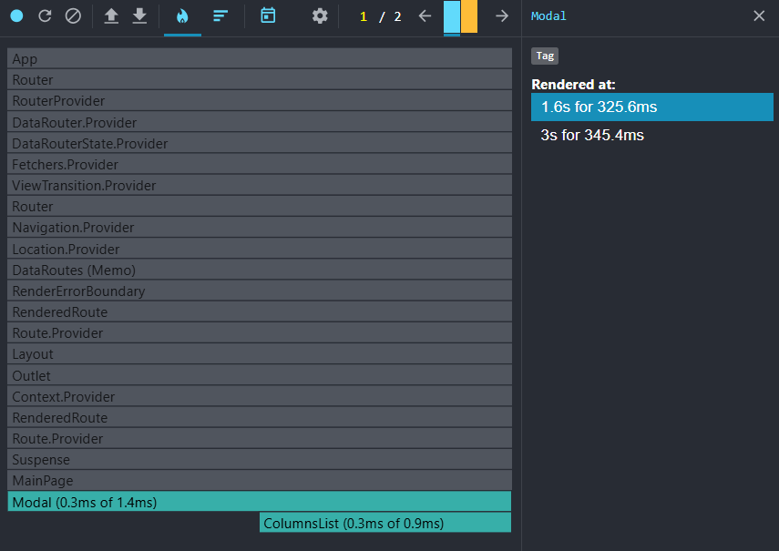

_After optimization_

- Commit Duration: 1.3s
- Render Duration: 311.6ms

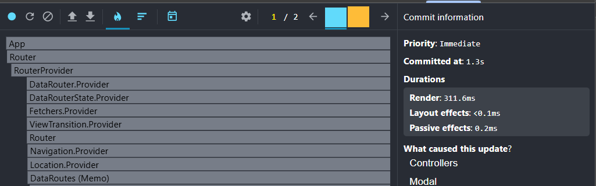
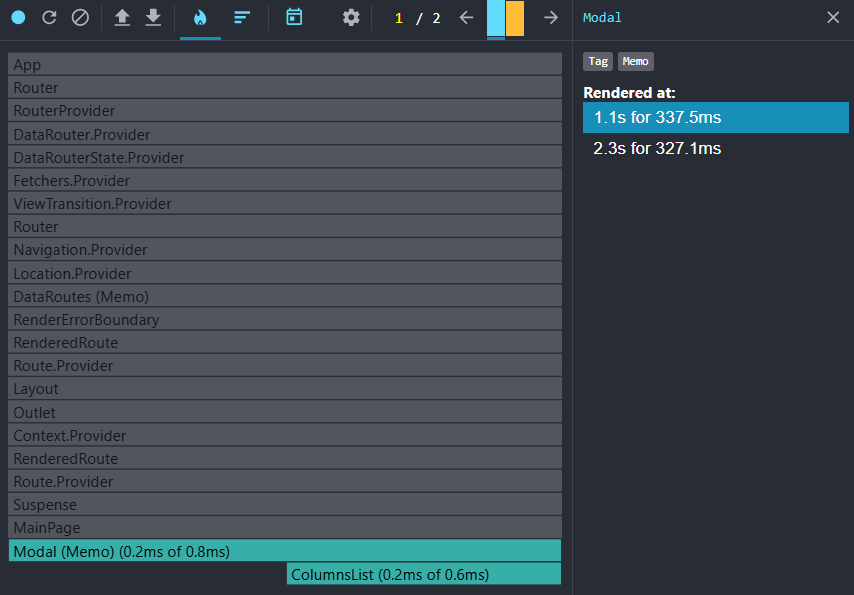

### Select year

_Before optimization_

- Commit Duration: 4.2s
- Render Duration: 412.8ms

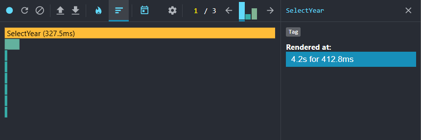

_After optimization_

- Commit Duration: 3.2s
- Render Duration: 357.2ms

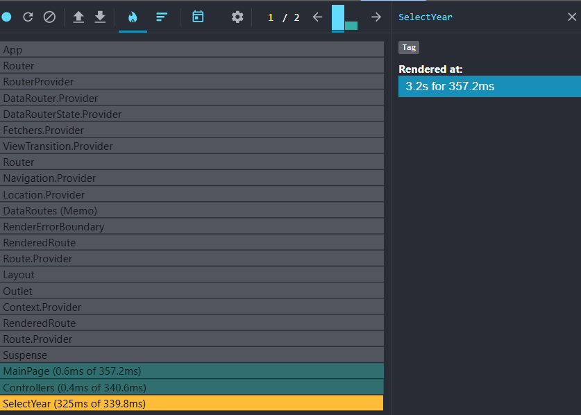
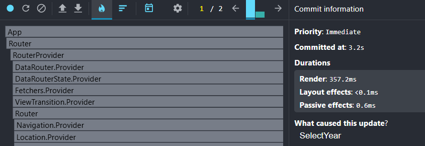

### Searching a country

_Before optimization_

- Commit Duration: 1.8s
- Render Duration: 82.5ms

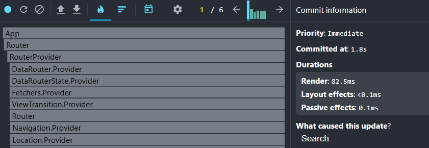
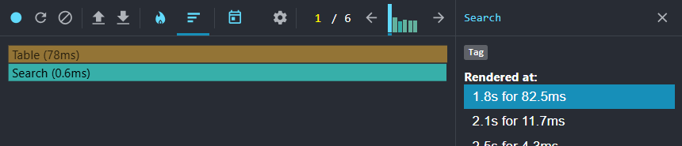

_After optimization_

- Commit Duration: 1.2s
- Render Duration: 78.3ms

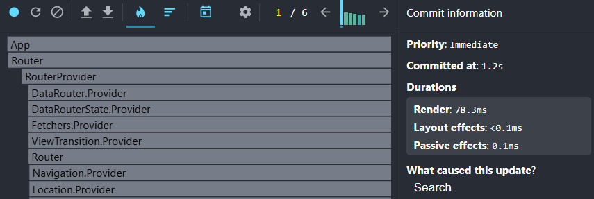

### Adding/removing columns

_Before optimization_

- Commit Duration: 1.5s
- Render Duration: 249.1ms

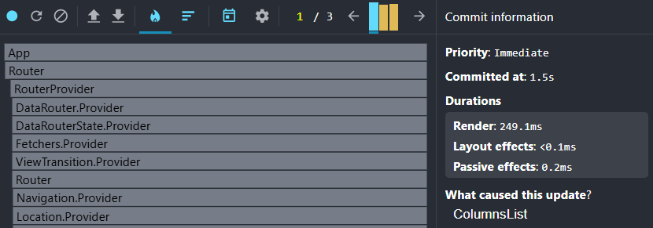
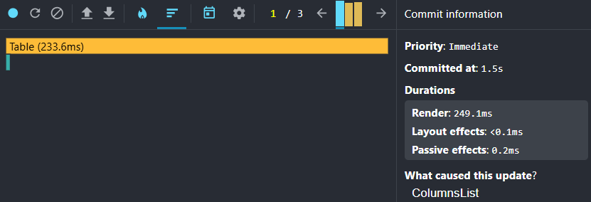

_After optimization_

- Commit Duration: 1.3s
- Render Duration: 172ms

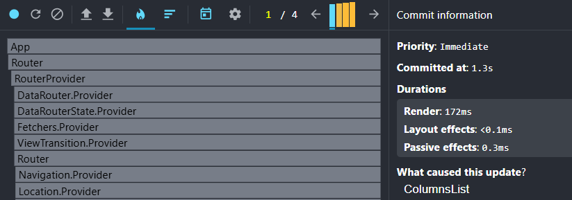
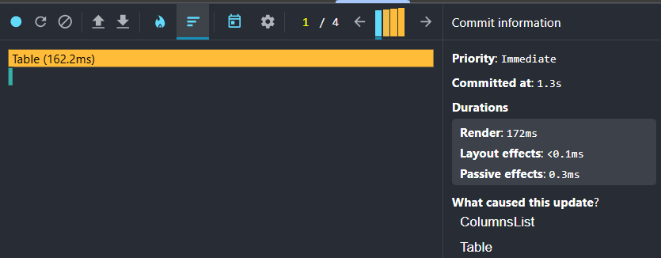

## 🛠️ Technologies

[](https://react.dev/)
[](https://www.typescriptlang.org/)
[](https://vitejs.dev/)
[](https://typicode.github.io/husky/#/)
[](https://eslint.org/)
[](https://prettier.io/)
[](https://github.com/okonet/lint-staged)
[](https://commitlint.js.org/#/)
[](https://tailwindcss.com/)

## 🎯 Requirements

- [React Performance](https://github.com/rolling-scopes-school/tasks/blob/master/react/modules/tasks/performance.md)

## 💻 Available Scripts

- `npm run dev` - run the application in development mode using Vite
- `npm run build` - build the production version of the application
- `npm run lint` - run ESLint to check for code style issues and errors
- `npm run prepare` - set up Husky Git hooks (automatically called by npm on install)
- `npm run format:fix` - format code automatically using Prettier
- `npm run commitlint` - validate commit messages against conventional commit rules
- `npm run preview` - preview the production build locally on a dev server

# 🚀 Installation

1. Clone the repository on your computer

```bash
git clone https://github.com/abeilleee/REACT2025Q3.git
```

2. Install all dependencies

```bash
npm install
```

3. Switch to the branch

```bash
git checkout perfomance
```

4. Run the application in the development mode

```bash
npm run dev
```
